# System Architecture: MarieCoder 🏗️

MarieCoder is designed with a strict emphasis on structural clarity and emotional alignment. The core architectural pattern is **Joy Zoning**, which protects the high-level intent from low-level mechanical noise.

---

## 🏗️ Joy Zoning Protocol

The system is partitioned into three distinct zones, each with its own purpose, constraints, and "vibe."

### 1. Joyful (Domain) ✨
- **Location**: `src/domain/`
- **Purpose**: Core application logic, project philosophy, and human-centric rituals.
- **Constraints**: Must remain "Environmentally Blind"—it must not depend on VS Code APIs or specific AI providers.
- **Key Components**:
  - `joy/RitualService.ts`: Manages the emotional state and rituals of the project.
  - `marie/MarieTypes.ts`: Definitions for the project's living history and objectives.

### 2. Infrastructure 🏗️
- **Location**: `src/infrastructure/`
- **Purpose**: Adapters and Orchestration. This layer implements the interfaces defined by the Domain using specific technologies.
- **Key Components**:
  - `ai/MarieEngine.ts`: The central orchestrator that coordinates sessions, tools, and progress.
  - `ai/ContextArchiveService.ts`: **Strategic Memory Anchor**. Persists critical snippets to `.marie_memory.json` to ground agent decisions across sessions.
  - `ai/AIProvider.ts`: Abstract interface for AI models (Anthropic, OpenRouter, etc.).
  - `tools/ToolRegistry.ts`: Manages the discovery and execution of Marie's autonomous tools.

### 2.5 Cross-Cutting Services 👻
- **`services/MarieGhostService.ts`**: Provides real-time "Ghost Text" previews. It intercepts tool deltas (like `replace_in_file`) and renders them in the editor as italicized previews with a `$(sync~spin)` status icon before they are committed to disk.
- **`services/MarieSCMProvider.ts`**: Coordinates with the VS Code source control view to provide gutter markers for AI-proposed changes.

### 3. Plumbing 🔧
- **Location**: `src/plumbing/`
- **Purpose**: The Mechanical Foundation. Low-level utilities for files, shell, and parsing.
- **Key Components**:
  - `filesystem/FileService.ts`: Mindful file operations.
  - `git/GitService.ts`: "Consulting the Echos" (reading git history).
  - `lsp/SymbolService.ts`: Strategic navigation via VS Code's language servers.

---

## 📐 The Downward Flow Law

Dependencies must strictly flow in one direction: **Joyful -> Infrastructure -> Plumbing**.

| From \ To | Joyful (Domain) | Infrastructure | Plumbing |
| :--- | :---: | :---: | :---: |
| **Joyful** | ✅ | ✅ | ✅ |
| **Infrastructure** | ❌ (Backflow) | ✅ | ✅ |
| **Plumbing** | ❌ (Backflow) | ❌ (Backflow) | ✅ |

> [!IMPORTANT]
> **Conceptual Backflow** occurs when a low-level module imports from a high-level one (e.g., Plumbing importing Domain). This is strictly forbidden and monitored via `audit_architectural_integrity`.

---

## ⚡ Reactive Event Flow

The `MarieEngine` operates on a reactive stream. Events flow from the AI session through a dispatcher to keep the UI and telemetry in sync.

```mermaid
sequenceDiagram
    participant U as User
    participant E as MarieEngine
    participant S as MarieSession
    participant P as AIProvider
    participant D as EventDispatcher
    participant T as MarieProgressTracker

    U->>E: User Request
    E->>S: executeLoop()
    S->>P: Stream Response
    P-->>S: Chunk Received
    S->>E: Event (content_delta/tool_use)
    E->>D: dispatch(event)
    D->>T: updateState()
    T-->>U: Progress Update ✨
```

---

## ⚡ Founder Policy Layer: MarieYOLO

MarieCoder now includes a founder-policy agent in the swarm: **MarieYOLO**.

### Purpose
- Preserve execution momentum when context is healthy.
- Detect structural uncertainty and dampen risky acceleration.
- Emit deterministic strategy signals for Council voting.

### Runtime Profiles
- `demo_day`: High momentum bias, stronger execution pressure.
- `balanced`: Default mixed behavior with risk-aware moderation.
- `recovery`: Safety-first profile that aggressively dampens risky hype.

### Config Knobs
- `marie.yoloEnabled` (boolean)
- `marie.yoloProfile` (`demo_day | balanced | recovery`)
- `marie.yoloAggression` (0.5–1.5 confidence multiplier)
- `marie.yoloMaxRequiredActions` (0–5 action hints)

### Decision Contract (Structured)
MarieYOLO emits a normalized decision payload including:
- strategy (`EXECUTE | DEBUG | RESEARCH | HYPE`)
- urgency (`LOW | MEDIUM | HIGH`)
- confidence (bounded)
- structural uncertainty flag
- continue directive flag
- required actions / blockers
- stop condition (`landed | structural_uncertainty`)

### Governance Interplay
- YOLO votes are weighted in Council consensus.
- Weight is boosted in healthy conditions and dampened in risk states.
- Panic cooldown and structural-uncertainty paths cap YOLO influence.
- YOLO telemetry is included in council snapshots for observability.

---
*Verified and Documented with Love. ✨*
